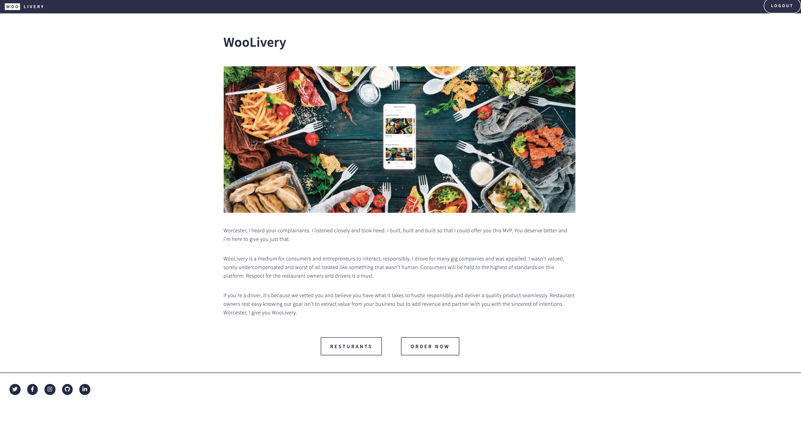
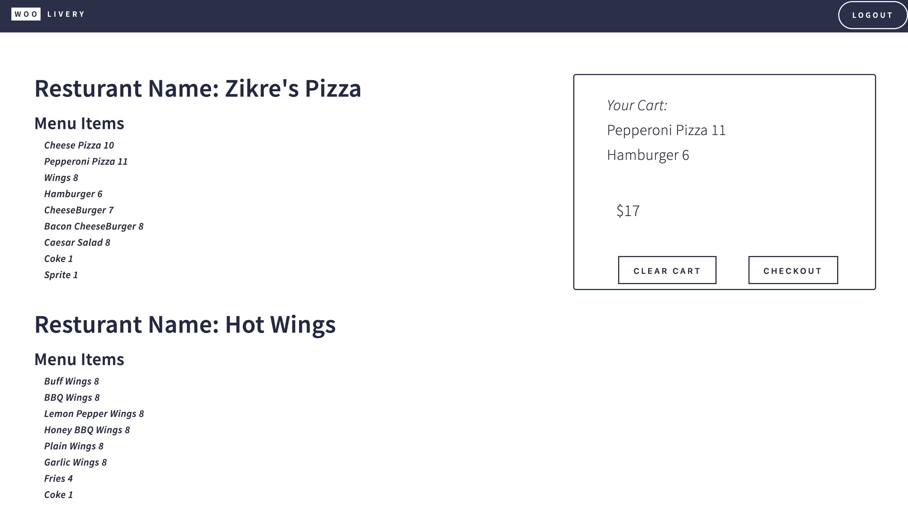
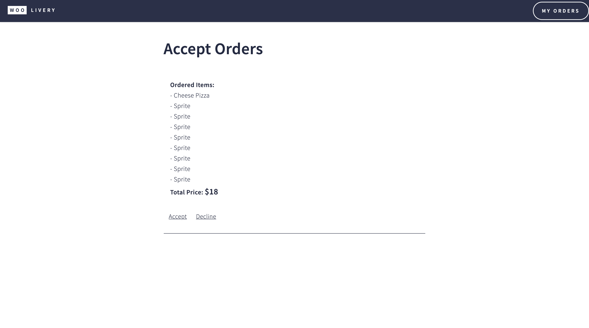

# WooLivery

Full Stack Application meant to recreate modern food delivery apps but with a twist. We're driver friendly. WooLivery aims to be a responsible medium for entrepreneurs and consumers to interact. The application is built for three types of users to use. People who want to order food, restaurant owners looking to sell food, drivers look to make money delivering orders.

## Link To Live Site Below

https://woolivery.herokuapp.com/

## The Home Page

## Restaurant Listings Page

## Customer Cart

## Order Confirmation page

## Driver Accept Order page

## Link To Live Site Below

https://woolivery.herokuapp.com/

## How This Site Was Made:

## Tech Used: HTML , CSS , JS , Node.js , MongoDB , Express , EJS, Nexamo API

This site is a culmination of weeks of building project after project. It begins with a markup similar to HTML5, whats unique is that there are many pages that use EJS. EJS allowed me to embed JavaScript onto the page which meant I could access data from my Mongo database. I made use of EJS partial's so that I could reuse some components and reduce redundant coding.

WooLivery has both client side and server side JavaScript. When ordering food customers, client side JS is being used but when that order is sent to the database I use Node.JS.

The application also has text alerts for the customer as their food is being made. I used Nexamo (now vonage) to send text messages.

## Lessons Learned:

1.) To deeply think about the architecture of the backend before building it out. This project gave me my first experience with overlooking a piece of data I would want and realizing down the road the hassle of incorporating it into project later. As someone who enjoys to work on the backend I need to be more wise about how I'm building my database collections.

2.) Spending more time analyzing the project from a user experience standpoint. I become so invested in the building of the backend that I nearly forgot about the customers and their experience on the platform. UX is a key to programming and I want to develop my skillset in that field.

3.) Using components more so that my code isn't redundant and I can allocate more time to building new features, instead of rewriting the same code for 10 different pages.

## Examples Of Other Work:

https://github.com/zikrehaimanot/memory-matching-game

https://github.com/zikrehaimanot/checkstockprice

https://github.com/zikrehaimanot/dogapi

https://github.com/zikrehaimanot/tictactoe

## How to Use the App:

1.) Clone repo  
2.) npm install  
3.) run node server.js  
4.)Navigate to localhost:8080  

## THEN

5.) signup and specify what type of user you are (restaurant owner, driver or user). (to get the full experience you'll need all three)  
6.) create a restaurant. 
7.) login as a customer and place an order at your restaurant. 
8.) go back into your restaurant account and accept the order and mark it completed. ( if you do this on an incognito tab you can keep the order status page open as a  customer and keep tracking it as the status gets updated.)  
9.) if you put your real phone number when signing up as a customer you should be receiving texts.  
10.) Drivers only see orders when they've been marked completed by the restaurant.  
11.) log in as a driver once you've marked the order completed as the restaurant owner.  
12.) accept your order.  
13.) your order will go to your my orders page.  
14 pick up the order and send the customer a reason why you're driving ( i drive to pay my student loans.) this pushes the customer to leave a healthy tip  
15.) deliver the order to the customer (text notifications still being sent)  
16.) on the customer portal you can also track the order on the order confirmation page.  
